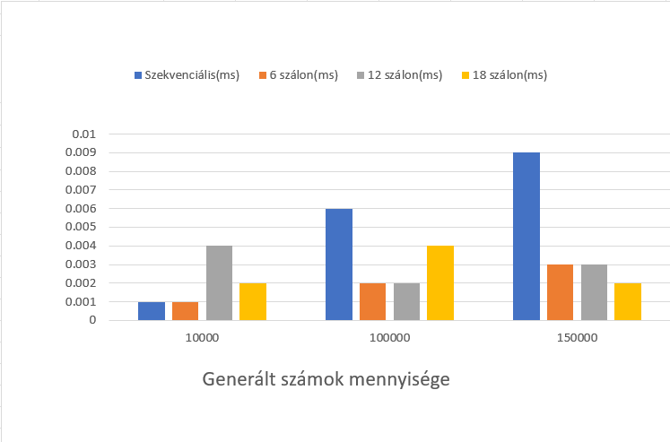

# U3ROFS_PARARELL-GRAPHICS

## Pararell beadandók:

### PARARELL/1.beadandó

#### Téma: Quick Sort
#### Leírás:
A program vár 2 paramétert: egy "n" értéket, és egy "threads_count" értéket. Az első bemeneti paraméter az, hogy mennyi számot generáljon a program, a második paraméter pedig az, hogy hány szálon végezze el az algoritmus. Az algoritmus a tömb elemeit résztömbökre osztja, majd a résztömbök elemeit összehasonlítja egy "pivot" értékkel, majd azokat a résztömböket rendezni, amelyekben az elemeik kisebbek vagy nagyobbak a pivotnál. A program ezen kívül tartalmaz egy párhuzamosított verziót is, amelyben a munkát több szál végzi el egyszerre.

 #### Futtatás:

    ./main {N} {threads_count}

 #### Mérések:

 <table>
    <tr>
        <th>N</th>
        <th>Szekvenciális(ms)</th>
        <th>6 szálon(ms)</th>
        <th>12 szálon(ms)</th>
    <tr>
    <tr>
        <td>10000</td>
        <td>0.001000</td>
        <td>0.001000</td>
        <td>0.004000</td>
    </tr>
     <tr>
        <td>100000</td>
        <td>0.006000</td>
        <td>0.002000</td>
        <td>0.002000</td>
    </tr>
    <tr>
        <td>150000</td>
        <td>0.009000</td>
        <td>0.003000</td>
        <td>0.003000</td>
    </tr>
</table>

### PARARELL/2.beadandó

#### Téma: Taylor sorbafejtés
#### Leírás:
A program vár három bemeneti paramétert: egy lebegőpontos "x" értéket, egy egész "n" értéket és egy egész "thread_count" értéket. Az első bemeneti paraméterre a cos, sin és exp függvények számítása során lesz szükség, a második bemeneti paraméter pedig meghatározza, hogy hány tagot kell számolni a Taylor sorozatokban. A harmadik bemeneti paraméter a párhuzamosított számítások száma, amelyeket a "cos_taylor", "sin_taylor" és "exp_taylor" függvényekben hajtanak végre.

 #### Futtatás:

    ./main {x} {n} {threads_count}

 #### Mérések:
 
 x=0.5

Szekvenciális: 
 <table>
    <tr>
        <th>N</th>
        <th>cos</th>
        <th>sin</th>
        <th>exp</th>
    <tr>
    <tr>
        <td>1000</td>
        <td>0.004000</td>
        <td>0.006000</td>
        <td>0.001000</td>
    </tr>
        <tr>
        <td>10000</td>
        <td>0.378000</td>
        <td>0.381000</td>
        <td>0.190000</td>
    </tr>
    </tr>
        <tr>
        <td>100000</td>
        <td>0.378000</td>
        <td>0.381000</td>
        <td>0.190000</td>
    </tr>
</table>

6 szálon:
 <table>
    <tr>
        <th>N</th>
        <th>cos</th>
        <th>sin</th>
        <th>exp</th>
    <tr>
    <tr>
        <td>1000</td>
        <td>0.002000</td>
        <td>0.003000</td>
        <td>0.001000</td>
    </tr>
        <tr>
        <td>10000</td>
        <td>0.117000</td>
        <td>0.117000</td>
        <td>0.060000</td>
    </tr>
    </tr>
        <tr>
        <td>100000</td>
        <td>11.852000</td>
        <td>11.765000</td>
        <td>5.869000</td>
    </tr>
</table>

12 szálon:
 <table>
    <tr>
        <th>N</th>
        <th>cos</th>
        <th>sin</th>
        <th>exp</th>
    <tr>
    <tr>
        <td>1000</td>
        <td>0.002000</td>
        <td>0.001000</td>
        <td>0.001000</td>
    </tr>
        <tr>
        <td>10000</td>
        <td>0.063000</td>
        <td>0.061000</td>
        <td>0.031000</td>
    </tr>
    </tr>
        <tr>
        <td>100000</td>
        <td>6.230000</td>
        <td>6.244000</td>
        <td>3.132000</td>
    </tr>
</table>

### PARARELL/3.beadandó

Téma: Order By, Search
Leírás: Több szálon történő rendezés, illetve keresés. C# nelyven, blazor és ASP .Net segítségével.
AsPararell().OrderBy összevetése az OrdeBy-al
AsPararell().Where összevetése a Where-el
Mérési eredmények a programban.
Tetszőlegesen állítható a szekvenciális és a párhuzamos futás.

## Grafika beadandó:

### GRAPHICS/beadandó

Téma:Dinós játék
Leírás: Egy dinóval kell kikerülni a kaktuszokat a sivatagban. A játéknak vége ha a dinó meghal.
